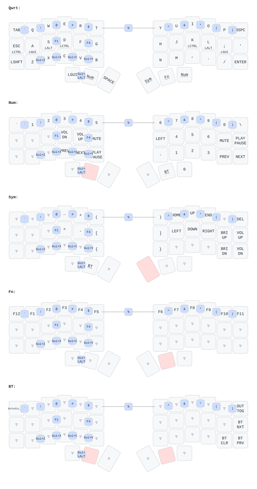

# ZMK Configuration for u_3x6+3

*Generated by Shield Wizard for ZMK*

## Keymap



Download compiled firmware from the Actions tab. <https://zmk.dev/docs/user-setup#installing-the-firmware>

Edit your keymap <https://zmk.dev/docs/keymaps>.
User keymap is located at [`config/u_3x6_3.keymap`](config/u_3x6_3.keymap).

-----

<details>
<summary>
Shield Wizard Debug Information
</summary>

In case of broken configuration, here is the Shield Wizard internal data used to generate this configuration:

Commit: 5840d41ac0915092c8fe45da617ffb4bb91e1b97

```json
{"name":"u_3x6+3","shield":"u_3x6_3","dongle":false,"modules":[],"layout":[{"id":"01KQSQGTW9T4PR0SWVDK7V087H","part":0,"row":0,"col":0,"w":1,"h":1,"x":0.63,"y":0.586,"r":15,"rx":1.13,"ry":1.086},{"id":"01KQSQGTW9F7QPQ572DB8TPH9N","part":0,"row":0,"col":1,"w":1,"h":1,"x":1.691,"y":0.489,"r":15,"rx":2.191,"ry":0.989},{"id":"01KQSQGTW9FR1E7DX6VPR2T7M3","part":0,"row":0,"col":2,"w":1,"h":1,"x":2.827,"y":0.112,"r":15,"rx":3.327,"ry":0.612},{"id":"01KQSQGTW9VNCFQFP66HEQVPG1","part":0,"row":0,"col":3,"w":1,"h":1,"x":3.862,"y":0.117,"r":15,"rx":4.362,"ry":0.617},{"id":"01KQSQGTW9B8JZ78HET8WQ5KAJ","part":0,"row":0,"col":4,"w":1,"h":1,"x":4.759,"y":0.63,"r":15,"rx":5.259,"ry":1.13},{"id":"01KQSQGTW95JA29EMXZPSXD5C9","part":0,"row":0,"col":5,"w":1,"h":1,"x":5.691,"y":1.016,"r":15,"rx":6.191,"ry":1.516},{"id":"01KQSQGTW93RVD831PG9YMCP23","part":0,"row":0,"col":6,"w":1,"h":1,"x":7.963,"y":1.016,"r":-15,"rx":8.463,"ry":1.516},{"id":"01KQSQGTW9D0THWBWGVG9CZ9Q0","part":0,"row":0,"col":7,"w":1,"h":1,"x":8.895,"y":0.63,"r":-15,"rx":9.395,"ry":1.13},{"id":"01KQSQGTW9WJFQXPZJ86N0136V","part":0,"row":0,"col":8,"w":1,"h":1,"x":9.793,"y":0.117,"r":-15,"rx":10.293,"ry":0.617},{"id":"01KQSQGTW98VN3FQNV7PX9S5S2","part":0,"row":0,"col":9,"w":1,"h":1,"x":10.827,"y":0.112,"r":-15,"rx":11.327,"ry":0.612},{"id":"01KQSQGTW9XMRF71STAKEM1G37","part":0,"row":0,"col":10,"w":1,"h":1,"x":11.963,"y":0.489,"r":-15,"rx":12.463,"ry":0.989},{"id":"01KQSQGTW95AJKMAAQSGH2FBA2","part":0,"row":0,"col":11,"w":1,"h":1,"x":13.024,"y":0.586,"r":-15,"rx":13.524,"ry":1.086},{"id":"01KQSQGTW97AA0A22PKZ41P4VX","part":0,"row":1,"col":0,"w":1,"h":1,"x":0.371,"y":1.552,"r":15,"rx":0.871,"ry":2.052},{"id":"01KQSQGTWA50KG3A6A72S19DEF","part":0,"row":1,"col":1,"w":1,"h":1,"x":1.432,"y":1.455,"r":15,"rx":1.932,"ry":1.955},{"id":"01KQSQGTWAW32NM2VSPH4CMWFB","part":0,"row":1,"col":2,"w":1,"h":1,"x":2.569,"y":1.078,"r":15,"rx":3.069,"ry":1.578},{"id":"01KQSQGTWA29ZDAYFVV6KZFQF1","part":0,"row":1,"col":3,"w":1,"h":1,"x":3.603,"y":1.083,"r":15,"rx":4.103,"ry":1.583},{"id":"01KQSQGTWAVPPF1K4GW5ZP677D","part":0,"row":1,"col":4,"w":1,"h":1,"x":4.501,"y":1.596,"r":15,"rx":5.001,"ry":2.096},{"id":"01KQSQGTWAZDBA8F5F8V105Q2C","part":0,"row":1,"col":5,"w":1,"h":1,"x":5.432,"y":1.982,"r":15,"rx":5.932,"ry":2.482},{"id":"01KQSQGTWAATK0K5TW3VYTSVW9","part":0,"row":1,"col":6,"w":1,"h":1,"x":8.222,"y":1.982,"r":-15,"rx":8.722,"ry":2.482},{"id":"01KQSQGTWAZDGAE2WPK5FET22T","part":0,"row":1,"col":7,"w":1,"h":1,"x":9.154,"y":1.596,"r":-15,"rx":9.654,"ry":2.096},{"id":"01KQSQGTWA85C6CHK8ZT1ZT1P7","part":0,"row":1,"col":8,"w":1,"h":1,"x":10.052,"y":1.083,"r":-15,"rx":10.552,"ry":1.583},{"id":"01KQSQGTWA2TV1ETA2VB2FFS5Q","part":0,"row":1,"col":9,"w":1,"h":1,"x":11.086,"y":1.078,"r":-15,"rx":11.586,"ry":1.578},{"id":"01KQSQGTWA3KCW7R3TV1KJDYNS","part":0,"row":1,"col":10,"w":1,"h":1,"x":12.222,"y":1.455,"r":-15,"rx":12.722,"ry":1.955},{"id":"01KQSQGTWANM8JK7H8FERFB8GG","part":0,"row":1,"col":11,"w":1,"h":1,"x":13.283,"y":1.552,"r":-15,"rx":13.783,"ry":2.052},{"id":"01KQSQGTWAGT97PW8PN17J03R4","part":0,"row":2,"col":0,"w":1,"h":1,"x":0.112,"y":2.518,"r":15,"rx":0.612,"ry":3.018},{"id":"01KQSQGTWAM9NWZT5PP13HAQ2J","part":0,"row":2,"col":1,"w":1,"h":1,"x":1.174,"y":2.421,"r":15,"rx":1.674,"ry":2.921},{"id":"01KQSQGTWAW4JS3NSXNXWR1NAE","part":0,"row":2,"col":2,"w":1,"h":1,"x":2.31,"y":2.044,"r":15,"rx":2.81,"ry":2.544},{"id":"01KQSQGTWAEXSRJBZDK74E8MDQ","part":0,"row":2,"col":3,"w":1,"h":1,"x":3.344,"y":2.049,"r":15,"rx":3.844,"ry":2.549},{"id":"01KQSQGTWAS044NFC1X9HHM24P","part":0,"row":2,"col":4,"w":1,"h":1,"x":4.242,"y":2.562,"r":15,"rx":4.742,"ry":3.062},{"id":"01KQSQGTWA0D0J16R93MSQ31TK","part":0,"row":2,"col":5,"w":1,"h":1,"x":5.174,"y":2.948,"r":15,"rx":5.674,"ry":3.448},{"id":"01KQSQGTWA8E2AN4G9C9Y0FASY","part":0,"row":2,"col":6,"w":1,"h":1,"x":8.481,"y":2.948,"r":-15,"rx":8.981,"ry":3.448},{"id":"01KQSQGTWATVWG18FBTMRYYVJZ","part":0,"row":2,"col":7,"w":1,"h":1,"x":9.413,"y":2.562,"r":-15,"rx":9.913,"ry":3.062},{"id":"01KQSQGTWA6Q51J3RJVYH6RNF2","part":0,"row":2,"col":8,"w":1,"h":1,"x":10.311,"y":2.049,"r":-15,"rx":10.811,"ry":2.549},{"id":"01KQSQGTWAWJ5HZAFVN6P85R7S","part":0,"row":2,"col":9,"w":1,"h":1,"x":11.345,"y":2.044,"r":-15,"rx":11.845,"ry":2.544},{"id":"01KQSQGTWAQ5KF129HJYEXYY75","part":0,"row":2,"col":10,"w":1,"h":1,"x":12.481,"y":2.421,"r":-15,"rx":12.981,"ry":2.921},{"id":"01KQSQGTWAZH910MJBRCTBW6YQ","part":0,"row":2,"col":11,"w":1,"h":1,"x":13.542,"y":2.518,"r":-15,"rx":14.042,"ry":3.018},{"id":"01KQSQGTWAM8YDY4SD1GVMBXP6","part":0,"row":3,"col":3,"w":1,"h":1,"x":3.915,"y":3.782,"r":15,"rx":4.415,"ry":4.282},{"id":"01KQSQGTWAR63RTHR8GCMKH1JF","part":0,"row":3,"col":4,"w":1,"h":1,"x":5.028,"y":4.168,"r":22,"rx":5.528,"ry":4.668},{"id":"01KQSQGTWAK1MGE98MNZWBAC5P","part":0,"row":3,"col":5,"w":1,"h":1,"x":6.088,"y":4.682,"r":30,"rx":6.588,"ry":5.182},{"id":"01KQSQGTWB2TJQF5F73A0WPD84","part":0,"row":3,"col":6,"w":1,"h":1,"x":7.567,"y":4.682,"r":-30,"rx":8.067,"ry":5.182},{"id":"01KQSQGTWBEXPS6K74JTD5JRK0","part":0,"row":3,"col":7,"w":1,"h":1,"x":8.627,"y":4.168,"r":-23,"rx":9.127,"ry":4.668},{"id":"01KQSQGTWBRR2D90XXNCHG6SZK","part":0,"row":3,"col":8,"w":1,"h":1,"x":9.74,"y":3.782,"r":-15,"rx":10.24,"ry":4.282}],"parts":[{"name":"unibody","controller":"nice_nano_v2","wiring":"matrix_diode","pins":{"d21":"output","d20":"output","d19":"output","d18":"output","d15":"output","d14":"output","d16":"output","d10":"output","d1":"output","d0":"output","d2":"output","d3":"output","d4":"input","d5":"input","d6":"input","d7":"input","d8":"encoder","d9":"encoder","p101":"bus","p102":"bus"},"keys":{"01KQSQGTW9T4PR0SWVDK7V087H":{"input":"d4","output":"d21"},"01KQSQGTW97AA0A22PKZ41P4VX":{"input":"d5","output":"d21"},"01KQSQGTWAGT97PW8PN17J03R4":{"input":"d6","output":"d21"},"01KQSQGTW9F7QPQ572DB8TPH9N":{"input":"d4","output":"d20"},"01KQSQGTWA50KG3A6A72S19DEF":{"input":"d5","output":"d20"},"01KQSQGTWAM9NWZT5PP13HAQ2J":{"input":"d6","output":"d20"},"01KQSQGTW9FR1E7DX6VPR2T7M3":{"input":"d4","output":"d19"},"01KQSQGTWAW32NM2VSPH4CMWFB":{"input":"d5","output":"d19"},"01KQSQGTWAW4JS3NSXNXWR1NAE":{"input":"d6","output":"d19"},"01KQSQGTW9VNCFQFP66HEQVPG1":{"input":"d4","output":"d18"},"01KQSQGTWAEXSRJBZDK74E8MDQ":{"input":"d6","output":"d18"},"01KQSQGTWA29ZDAYFVV6KZFQF1":{"input":"d5","output":"d18"},"01KQSQGTWAM8YDY4SD1GVMBXP6":{"input":"d7","output":"d18"},"01KQSQGTW9B8JZ78HET8WQ5KAJ":{"input":"d4","output":"d15"},"01KQSQGTWAVPPF1K4GW5ZP677D":{"input":"d5","output":"d15"},"01KQSQGTWAS044NFC1X9HHM24P":{"input":"d6","output":"d15"},"01KQSQGTWAR63RTHR8GCMKH1JF":{"input":"d7","output":"d15"},"01KQSQGTW95JA29EMXZPSXD5C9":{"input":"d4","output":"d14"},"01KQSQGTWAZDBA8F5F8V105Q2C":{"input":"d5","output":"d14"},"01KQSQGTWA0D0J16R93MSQ31TK":{"input":"d6","output":"d14"},"01KQSQGTWAK1MGE98MNZWBAC5P":{"input":"d7","output":"d14"},"01KQSQGTW93RVD831PG9YMCP23":{"input":"d4","output":"d16"},"01KQSQGTWAATK0K5TW3VYTSVW9":{"input":"d5","output":"d16"},"01KQSQGTWA8E2AN4G9C9Y0FASY":{"input":"d6","output":"d16"},"01KQSQGTWB2TJQF5F73A0WPD84":{"input":"d7","output":"d16"},"01KQSQGTW9D0THWBWGVG9CZ9Q0":{"input":"d4","output":"d10"},"01KQSQGTWAZDGAE2WPK5FET22T":{"input":"d5","output":"d10"},"01KQSQGTWATVWG18FBTMRYYVJZ":{"input":"d6","output":"d10"},"01KQSQGTWBEXPS6K74JTD5JRK0":{"input":"d7","output":"d10"},"01KQSQGTW9WJFQXPZJ86N0136V":{"input":"d4","output":"d1"},"01KQSQGTWA85C6CHK8ZT1ZT1P7":{"input":"d5","output":"d1"},"01KQSQGTWA6Q51J3RJVYH6RNF2":{"input":"d6","output":"d1"},"01KQSQGTWBRR2D90XXNCHG6SZK":{"input":"d7","output":"d1"},"01KQSQGTW98VN3FQNV7PX9S5S2":{"input":"d4","output":"d0"},"01KQSQGTWA2TV1ETA2VB2FFS5Q":{"input":"d5","output":"d0"},"01KQSQGTWAWJ5HZAFVN6P85R7S":{"input":"d6","output":"d0"},"01KQSQGTW9XMRF71STAKEM1G37":{"input":"d4","output":"d2"},"01KQSQGTWA3KCW7R3TV1KJDYNS":{"input":"d5","output":"d2"},"01KQSQGTWAQ5KF129HJYEXYY75":{"input":"d6","output":"d2"},"01KQSQGTW95AJKMAAQSGH2FBA2":{"input":"d4","output":"d3"},"01KQSQGTWANM8JK7H8FERFB8GG":{"input":"d5","output":"d3"},"01KQSQGTWAZH910MJBRCTBW6YQ":{"input":"d6","output":"d3"}},"encoders":[{"pinA":"d8","pinB":"d9"}],"buses":[{"name":"spi0","devices":[],"type":"spi"},{"name":"spi1","devices":[],"type":"spi"},{"name":"spi2","devices":[],"type":"spi"},{"name":"spi3","devices":[],"type":"spi"},{"name":"i2c0","devices":[{"type":"ssd1306","add":60,"width":128,"height":32}],"type":"i2c","sda":"p102","scl":"p101"},{"name":"i2c1","devices":[],"type":"i2c"}]}]}
```

</details>
